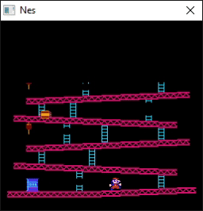

<h1 align="center"> NESEmulator </h1>

## Inputs
A - <kbd> F </kbd>

B - <kbd> D </kbd>

Select - <kbd> S </kbd> 

Start - <kbd> Enter </kbd> 

Up - <kbd> &uarr; </kbd> 

Down - <kbd> &darr;</kbd>

Left - <kbd> &larr; </kbd>

Right - <kbd> &rarr; </kbd>

## Inspiration

My journey to code the Nintendo Entertainment System. I have some early childhood memories of playing games Dragon Quest or Final Fantasy on the NES.

The nes cpu is similar to a 6052 cpu. The picture processing unit or PPU is 2C02. I was able to implement the cpu to run all official instructions, but got stuck on the ppu. My ppu implementation is from https://github.com/OneLoneCoder/olcNES. 

I use win32 to create the window and render the screen of the NES. Donkey Kong is the only game that the emulator runs so in order to run it you must have the donkey kong nes rom in the NES folder. 

I didn't implement anything to accurately time the cycles to the NES so the emulator runs faster than an actual NES on my computer. 

Below is an example of what running the program looks like.

  

